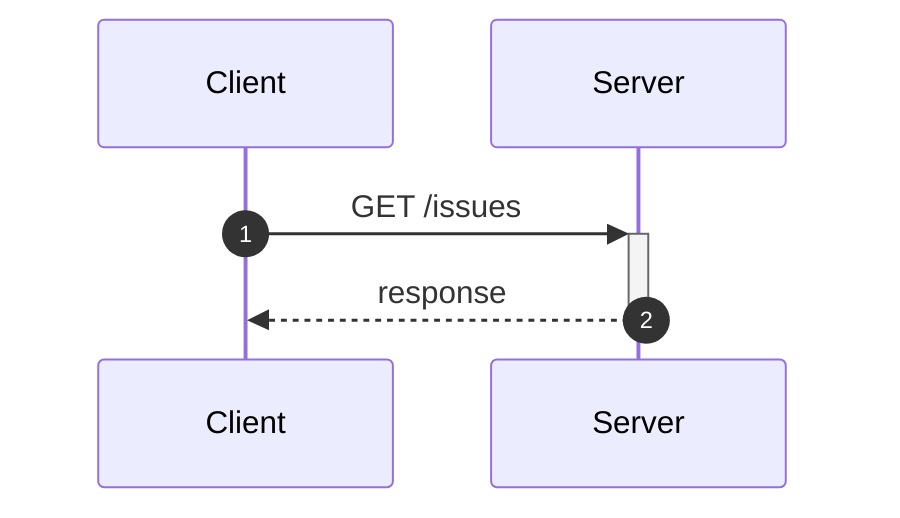
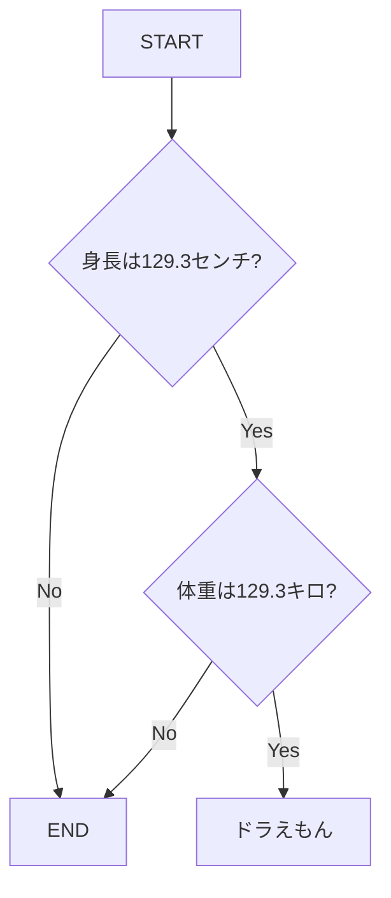
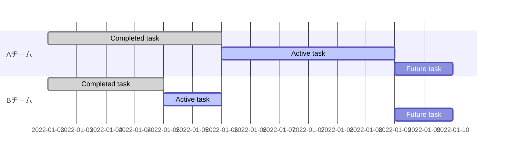

# dev-mermaid

mermaidnの反映の確認

```mermaid
  graph TD;
      A-->B;
      A-->C;
      B-->D;
      C-->D;
```

## シーケンス図

```mermaid
sequenceDiagram
  autonumber
  Client->>+Server: GET /issues
  Server-->>-Client: response
```

## フローチャート

```mermaid
flowchart TD
  START-->A{身長は129.3センチ?}
  A-->|No|END
  A-->|Yes|B{体重は129.3キロ?}
    B-->|Yes|ドラえもん
    B-->|No|END
```

## ガントチャート

```mermaid
gantt
  section Aチーム
  Completed task :done,   a1, 2022-01-03, 3d
  Active task    :active, a2, after a1,   3d
  Future task    :        a3, after a2,   1d

  section Bチーム
  Completed task :done,   b1, 2022-01-03, 2d
  Active task    :active, b2, after b1,   1d
  Future task    :        b3, after a2,   1d
  
```

